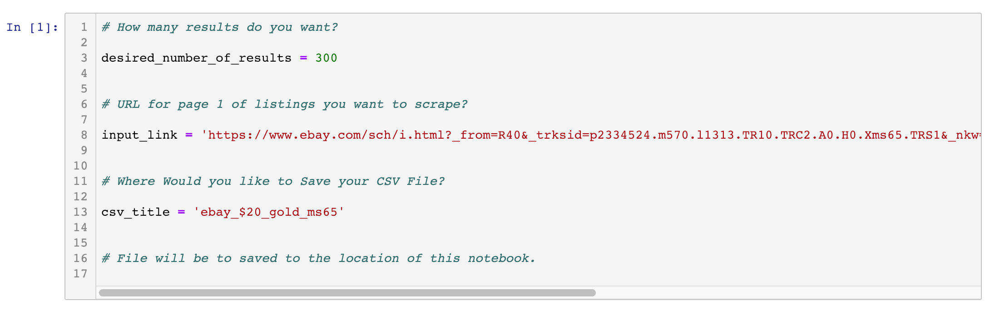

# 
 Scraping Listings Data

##  [Click here to view Scraper Notebook](https://nbviewer.jupyter.org/github/Daniel-Lomeland/Scraping_and_Visualizing_eBay_Data/blob/master/Scraping_Completed_Listings/scrape_completed_listings.ipynb)

## 
 Easily collect historical ebay listing info in a csv format!

## 
 Example of output CSV in Excel

